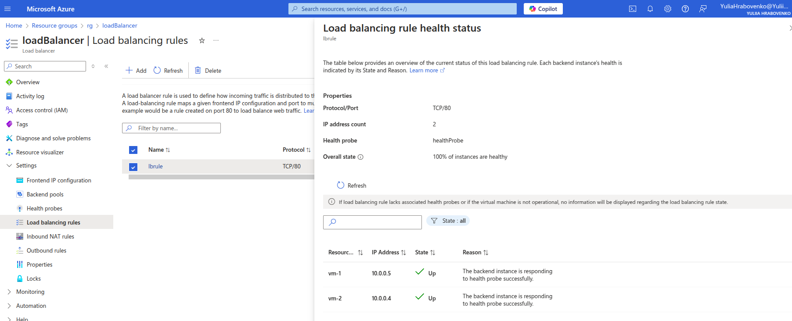

# Advanced DevOps Concepts Practical Tasks

**Task 1: Implementing Basic Security Scans in Azure Pipelines**

**Objective:** Set up a basic security scanning tool in an Azure DevOps pipeline to analyze
code for vulnerabilities during the CI/CD process, using tools that offer free tiers or are
open-source.

**Steps:**
- Log in to your Azure DevOps account and navigate to your project.
- Create a new pipeline or edit an existing one.
- Choose one of the following tools to integrate into your pipeline:
  - SonarCloud:
    Integrate SonarCloud into your Azure DevOps pipeline by adding a task to
    analyze your code during the build process. SonarCloud offers a free tier for
    open-source projects.
  - Trivy:
    Use Trivy in your Azure Pipelines to scan Docker images or other
    artifacts for vulnerabilities. Trivy is a comprehensive vulnerability
    scanner that is open-source and free to use.
  - OWASP ZAP (Zed Attack Proxy):
    Set up OWASP ZAP in your Azure Pipelines to scan web applications as part
    of your CI/CD process. OWASP ZAP is open-source and free to use.
  - Bandit (for Python projects):
    Create a custom task in your Azure DevOps pipeline to run Bandit against
    your Python codebase. Bandit is an open-source tool designed to find
    common security issues in Python code.
- Configure the selected tool to run during the build stage and analyze the code or artifacts for vulnerabilities.
- Run the pipeline and review the scan results to identify any vulnerabilities.
- Address any identified issues and re-run the pipeline to ensure they are resolved.

**Task 2: Integrating Azure Security Center with DevOps Workflows**

**Objective:** Configure Azure Security Center to monitor resources and integrate its alerts
into Azure DevOps workflows for automated security incident response.

**Steps:**

- Enable Azure Security Center in your Azure subscription.
- Set up security policies and recommendations for your resources.•
- Configure alerts for security incidents and integrate them with Azure DevOps using Azure Logic Apps or Azure Functions.
- Create an Azure DevOps work item automatically when a security alert is triggered.
- Test the integration by simulating a security incident and verifying that the workflow responds appropriately.

**Task 3: Implementing a Comprehensive DevSecOps Strategy with Azure Policy and Automation**

**Objective:** Implement a comprehensive DevSecOps strategy using Azure Policy, Azure Blueprints, and automation to enforce security best practices, ensure compliance, and streamline governance across your Azure environments.

**Steps:**

- **Create Azure Policies:**
    Navigate to the Azure Portal and go to "Policy." Create or select existing policies that enforce security best practices, such as requiring encryption at rest, ensuring secure network configurations, or enforcing tag usage for resources. Assign these policies to your Azure subscriptions or resource groups to start auditing resources for compliance.

- **Set Up Azure Blueprints:**
    In the Azure Portal, go to "Blueprints." Create a new blueprint definition that includes your Azure Policies, resource templates, and RBAC assignments. Publish and assign the blueprint to your target subscriptions to ensure consistent deployment of resources and policies.

- **Automate Compliance Monitoring:**
    Use Azure Monitor to set up alerts for policy compliance states. Configure Log Analytics to collect and analyze data on policy compliance, creating dashboards to visualize this data.

- **Implement Automated Remediation:**
    Use Azure Automation or Azure Functions to create runbooks or scripts that automatically remediate common policy violations, such as enabling encryption or applying missing tags. Trigger these runbooks based on alerts from Azure Monitor when policy violations are detected.

- **Configure Role-Based Access Control (RBAC):**
    Go to "Access control (IAM)" in the Azure Portal for your resources. Assign roles that adhere to the principle of least privilege, ensuring users have only the permissionsthey need. Regularly review role assignments and adjust as necessary based on access requirements.

- **Integrate with Azure DevOps:**
    Set up Azure DevOps pipelines to include policy compliance checks using Azure CLI or Azure PowerShell tasks. Use these tasks to ensure that resources deployed through the pipeline are compliant with your defined policies.

- **Test and Validate the Implementation:**
    Deploy a test resource using your blueprint and verify that all policies are applied and compliant. Simulate a policy violation and test the automated remediation process to ensure it works as expected.

[TagPolicyRemediationRunbook.ps1](devsecops_strategy/TagPolicyRemediationRunbook.ps1)

**Task 5: Implementing Chaos Engineering in Azure with Azure Chaos Studio**

**Objective:** Use Azure Chaos Studio to conduct chaos experiments on Azure resources, testing the resilience of your applications and infrastructure to improve their reliability and stability.

**Steps:**

- **Set Up Azure Chaos Studio:**
    Navigate to the Azure Portal and search for "Chaos Studio." 
    Enable Chaos Studio for your Azure subscription, ensuring you have the necessary permissions to create and manage chaos experiments.

- **Define the Scope and Objectives:**
    Identify the Azure resources (e.g., Virtual Machines, App Services, Azure Kubernetes Service) you want to test. 
    Clearly define the objectives of your chaos experiments, such as testing the system's ability to recover from VM failures or network disruptions.

- **Create a Chaos Experiment:**
    In Azure Chaos Studio, create a new chaos experiment. 
    Define the experiment's target resources and specify the chaos actions you want to perform, such as shutting down VMs, introducing network latency, or simulating disk failures.

- **Configure Experiment Parameters:**
    Set up the duration, intensity, and scheduling of the chaos actions within the experiment. 
    Ensure you have monitoring and alerting in place to observe the impact of the experiment on your system.

- **Execute the Chaos Experiment:**
    Run the chaos experiment in a controlled environment, such as a staging environment or during off-peak hours in production. 
    Monitor the system's behavior in real-time using Azure Monitor, Application Insights, or other logging tools to capture relevant metrics and logs.

- **Analyze the Results:**
    After the experiment, review the collected data to assess how the system handled the induced failures. 
    Identify any weaknesses or unexpected behaviors and document the findings.

- **Implement Improvements:**
    Based on the analysis, implement necessary changes to enhance the resilience of your applications and infrastructure. 
    This may include optimizing failover strategies, improving load balancing, or enhancing monitoring and alerting mechanisms.

- **Iterate and Expand:**
    Refine your chaos experiments based on learnings and try again.

