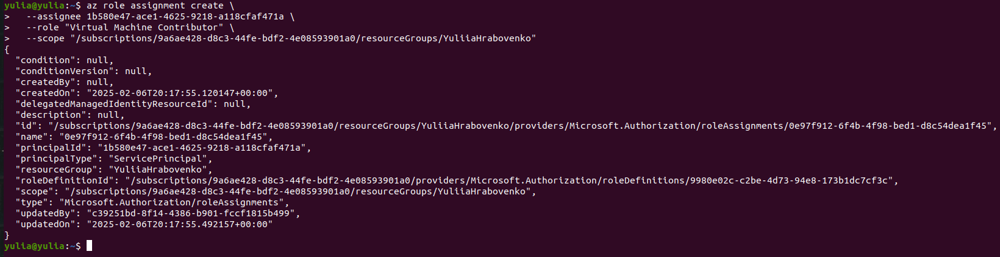
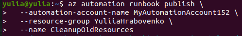

# Azure Cli and Azure PowerShell and Azure Automation Practical tasks

**Practical Task 1: Install and Configure Azure CLI and PowerShell**

**Requirements:**

- Install Azure CLI and Azure PowerShell on your local machine.
- Verify the installation by checking the versions of Azure CLI and PowerShell modules.
- Log in to your Azure account using both Azure CLI and PowerShell.
- List all available subscriptions in your Azure account using both tools.


**Practical Task 2: Create and Manage Resource Groups**

**Requirements:**

- Use Azure CLI to create a new resource group named MyResourceGroup in the East US region.
- Use Azure PowerShell to create a new resource group named MyPSResourceGroup in the West Europe region.
- List all resource groups in your subscription using both CLI and PowerShell.
- Delete the resource group MyResourceGroup using Azure CLI.
- Delete the resource group MyPSResourceGroup using Azure PowerShell.


**Practical Task 3: Deploy and Manage Virtual Machines using Azure CLI and PowerShell**

**Requirements:**

- Use Azure CLI to create a new virtual machine named MyVM1 in a new resource group VMResourceGroup.
- Use Azure PowerShell to create another virtual machine named MyVM2 in the same resource group.
- Retrieve details about both virtual machines using both CLI and PowerShell.
- Stop MyVM1 using Azure CLI and MyVM2 using Azure PowerShell.
- Delete the virtual machines using the respective tools.


**Practical Task 4: Manage Storage Accounts using Azure CLI and PowerShell**

**Requirements:**

- Use Azure CLI to create a new storage account named mystoragecli in the East US region.
- Use Azure PowerShell to create a new storage account named mystorageps in the West Europe region.
- List all storage accounts in the subscription using both CLI and PowerShell.
- Retrieve the connection string for the mystoragecli storage account using Azure CLI.
- Retrieve the connection string for the mystorageps storage account using Azure PowerShell.
- Delete both storage accounts using the respective tools.


**Practical Task 5: Assign Role-Based Access Control (RBAC) Roles**

**Requirements:**

- Create a new Azure Active Directory user named testuser@example.com using Azure CLI.
- Assign the Reader role to testuser@example.com for a specific resource group using Azure CLI.
- Use Azure PowerShell to assign the Contributor role to testuser@example.com for a specific storage account.
- Verify that the user has been assigned the correct roles using both CLI and PowerShell.
- Remove the user’s role assignments using the respective tools.


**Practical Task 6: Set Up a Scalable Web Server with VM, Storage, and Networking**

**Requirements:**

- Create a Resource Group
  - Use Azure CLI to create a resource group named WebServerGroup in the East US region.
- Deploy a Virtual Network (VNet) and Subnet
  - Use Azure CLI to create a virtual network named WebVNet in WebServerGroup.
  - Add a subnet named WebSubnet.

- Create a Storage Account for Logs
  - Use Azure PowerShell to create a storage account named webserverlogs in WebServerGroup.
  - Enable blob storage and set up a container named logs for storing application logs.
- Deploy a Virtual Machine as a Web Server
  - Use Azure CLI to create a virtual machine named WebVM in WebServerGroup.
  - Configure WebVM to use the WebVNet and WebSubnet.
  - Open port 80 on the VM for web traffic.
- Install and Configure Nginx on the VM
  - Use Azure CLI to execute a script on WebVM that installs and configures Nginx as a web server.
- Enable Diagnostics and Store Logs in Storage Account
  - Use Azure PowerShell to enable diagnostics on WebVM, directing logs to webserverlogs storage account.
- Verify the Web Server is Running
  - Retrieve the public IP of WebVM using Azure CLI.
  - Access the Nginx default page from a web browser using ```http://<Public-IP>```.
- Clean Up Resources
  -Delete all created resources (WebVM, webserverlogs, WebVNet, WebServerGroup) using both Azure CLI and PowerShell.


**Practical Task 7: Create and Run an Azure Automation Runbook**

**Requirements:**

- Create an Azure Automation Account named MyAutomationAccount in the East US region using Azure CLI.
- Create a PowerShell Runbook named StartAzureVMRunbook inside MyAutomationAccount.
- Edit the Runbook to start a specified Azure Virtual Machine when executed.
- Test the Runbook manually by executing it and verifying that the VM starts.
- Publish the Runbook and set up a schedule to automatically run it every day at 6:00 AM.


[StartAzureVMRunbook.ps1](runbook/StartAzureVMRunbook.ps1)





**Practical Task 8: Automate Resource Cleanup Using a PowerShell Runbook**

**Requirements:**

- Create a new Runbook named CleanupOldResources in MyAutomationAccount.
- Write a PowerShell script that:
  - Lists all resource groups that have not been used in the past 30 days.
  - Deletes unused resource groups after user confirmation.
    - Test the Runbook in Azure Automation.
    - Publish the Runbook and configure a webhook to trigger it on demand.
    - Call the webhook using Azure CLI and verify the cleanup process.


[DeleteUnusedResources.ps1](resource_cleanup/DeleteUnusedResources.ps1)





**Practical Task 9: Implement Desired State Configuration (DSC) to Enforce VM Settings**

**Requirements:**

- Create a new Azure Automation DSC Configuration named MyDSCConfig.
- Define a DSC script that:
  - Ensures the Windows feature Web-Server (IIS) is installed on a Windows VM.
  - Ensures a specific configuration file (C:\inetpub\wwwroot\config.xml) exists with predefined content.
- Ensures that a required Windows service (e.g., w3svc) is always running.
  - Compile and publish the DSC configuration in Azure Automation.
  - Assign the DSC configuration to an existing VM and verify compliance.
  - Force a non-compliant state (e.g., stop the service or delete the config file), then observe Azure Automation remediating the issue automatically.


[MyDSCConfig.ps1](dsc/MyDSCConfig.ps1)


**Practical Task 10: Automate Multi-Resource Deployment and Configuration Using Runbooks and DSC**

**Requirements:**

- Create a new Runbook named DeployAndConfigureWebServer.
- Inside the Runbook, automate the following tasks:
  - Create a new VM named WebServerVM.
  - Attach a managed disk to WebServerVM.
- Deploy a DSC configuration to ensure IIS is installed and a website is running.
  - Publish and execute the Runbook, ensuring the web server is deployed and configured automatically.
  - Verify the deployment by accessing the website hosted on the VM via its public IP address.
  - Implement logging within the Runbook to track execution progress.


[MultiResourceDeploy.ps1](multi-resource_runbooks_dsc/MultiResourceDeploy.ps1)


