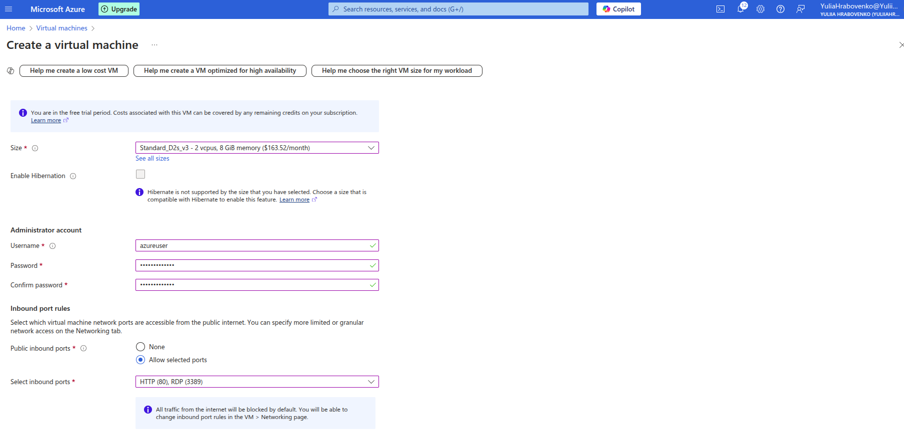
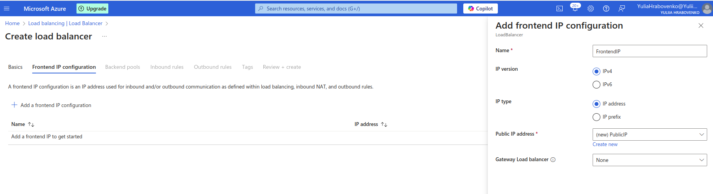
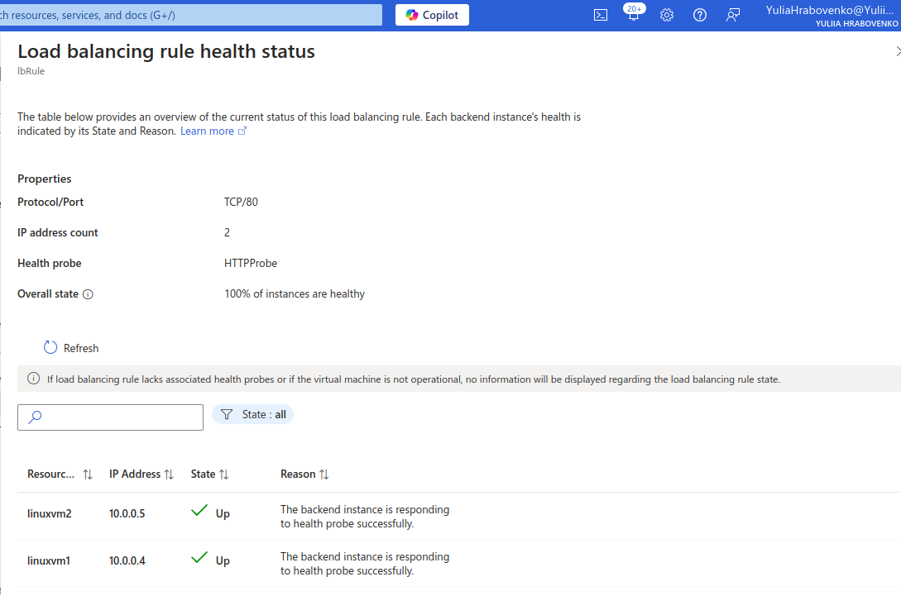
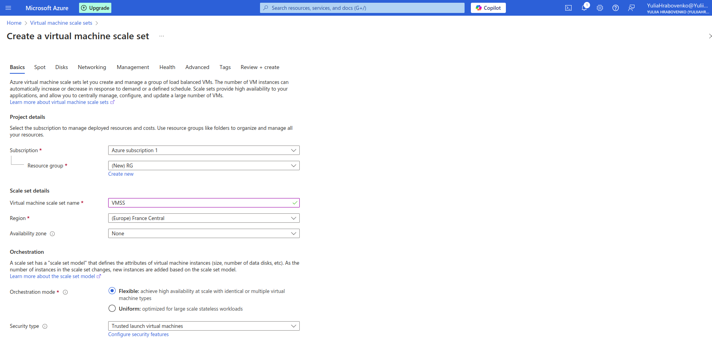

# Azure Compute Services Practical tasks

**Practical Task 1: Linux Virtual Machine Setup and NSG Configuration**

*Create and configure a Linux Virtual Machine (VM) on Azure and secure it with a Network Security Group (NSG)*

Create a Linux VM (Ubuntu or CentOS) in Azure

Connect to the VM via SSH using a public-private key pair

Install and configure an Nginx web server on the VM

Create and configure a Network Security Group (NSG) to allow only HTTP (port 80) and SSH (port 22) traffic

Test access to the Nginx web server from a browser

Verify that any other ports are blocked by the NSG

**Practical Task 2: Windows Virtual Machine and RDP Access Setup**

*Set up a Windows Virtual Machine (VM) on Azure and configure access via Remote Desktop Protocol (RDP)*

Create a Windows VM (e.g., Windows Server 2019) in Azure

Enable and configure Remote Desktop Protocol (RDP) for secure access to the VM

Connect to the VM via RDP using Azure credentials

Install a web server role (IIS) and deploy a simple test HTML page

Verify access to the test page from a browser

Ensure that unnecessary ports are closed, allowing only RDP (port 3389) and HTTP (port 80)

**Practical Task 3: Configuring an Azure Load Balancer**

*Create and configure a Basic Azure Load Balancer to distribute traffic across multiple virtual machines*

Create two Linux virtual machines in the same region and virtual network using the Azure Free Tier

VM1 creation

VM2 creation

Install and configure a web server (e.g., Nginx on Linux or IIS on Windows) on both VMs with unique content for testing

Create a Basic Load Balancer in Azure (included in the free tier) and configure it to balance HTTP (port 80) traffic between the two virtual machines

Configure a health probe to monitor the availability of the VMs

Test the Load Balancer by accessing its public IP address from a browser and verify that traffic is routed to both VMs (by observing the unique content from each server)

Verify that the Load Balancer removes unavailable VM from the traffic pool when it fails the health probe

Stop VM2

**Practical Task 4: Configuring a Basic Load Balancer with Virtual Machine Scale Sets (VMSS)**

*Set up a Basic Azure Load Balancer to distribute traffic across a Virtual Machine Scale Set (VMSS)*

Create a Virtual Machine Scale Set (VMSS) in Azure using Linux or Windows instances within the free tier (for example B1s size). Limit the scale set to two VM instances to avoid exceeding the free-tier 750-hour limit

Configure the Basic Load Balancer to distribute HTTP (port 80) traffic across the VM instances in the scale set and add a health probe to monitor the availability of instances in the VMSS

Add a custom configuration to install and configure a Nginx web server on each Linux VM instance

Load balancer health status with two VMs in the scale set

Scale the VMSS manually by increasing the number of instances to verify the Load Balancer routes traffic to the newly added VMs

Newly added VM

Test the setup by accessing the Load Balancer's public IP address and verifying traffic distribution across multiple VM instances

Test access to the newly added VM

Verify that the Load Balancer removes an unavailable instance from the traffic pool when it fails the health probe

**Practical Task 5: Deploying a Web Application Using Azure App Services**

*Set up and deploy a simple web application using Azure App Services*

Create an Azure App Service (Web App) using the Azure Free Tier. Select the runtime stack of your choice (e.g., .NET, Python, Node.js) during the setup

Link GitHub repository to deploy code to Azure App Service

Develop or use a sample web application (e.g., a "Hello World" app)

Push code and trigger deployment

Test the deployed application by accessing its URL provided by Azure App Services

Enable App Service Logs

Verify that application logs are being generated

**Practical Task 6: Creating and Deploying an Azure Function to Process HTTP Requests**

*Set up and deploy an Azure Function that processes HTTP requests directly from the Azure portal*

Create a new Function App using the Consumption (Serverless) plan within the free tier. Select the HTTP trigger template. Choose a language of your choice (e.g., C#, JavaScript, or Python)

Test the function using the Test/Run feature in the Azure portal to send HTTP requests

Verify the Function responds appropriately with and without the name parameter

Test the Function using a browser or a tool like Postman to ensure it's externally accessible

Check metrics like execution count, response time, and errors in the the Monitor tab of the Function App

