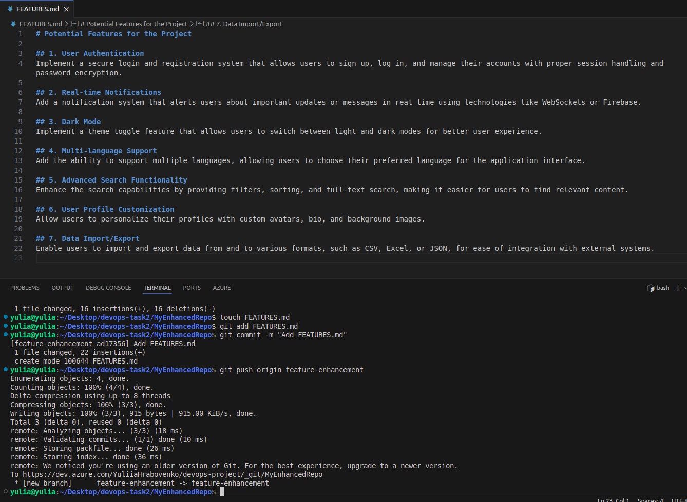
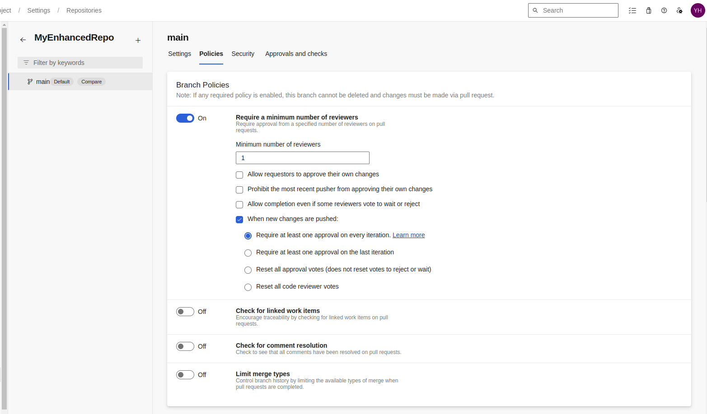
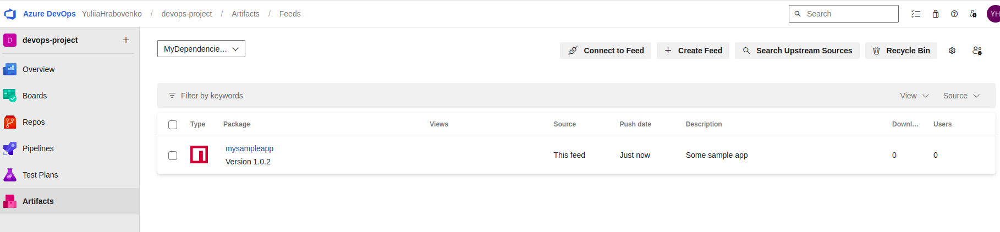
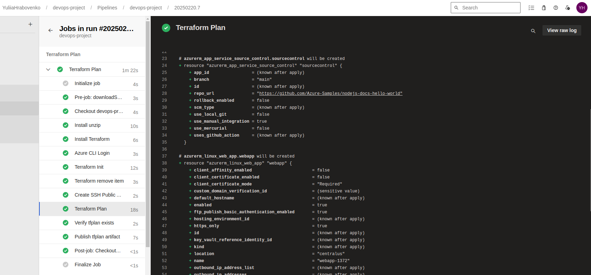
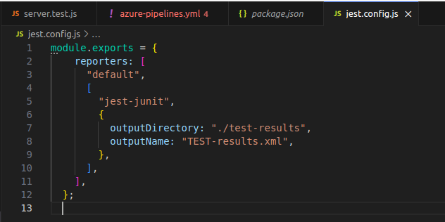
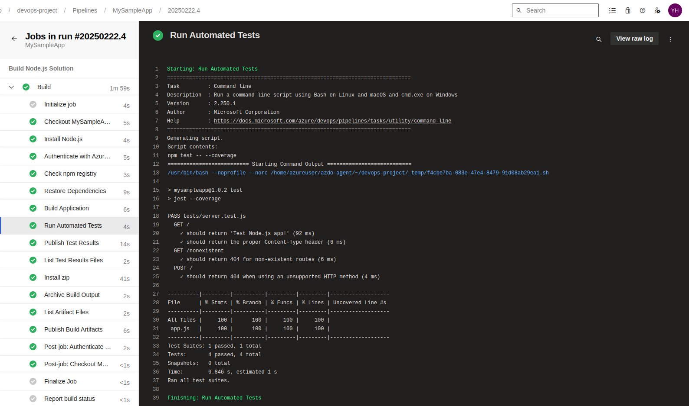
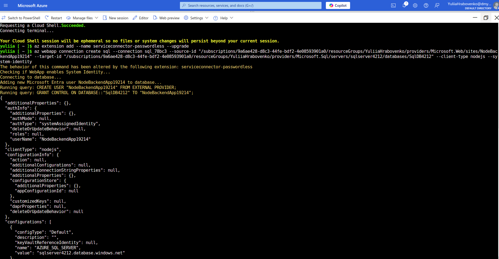
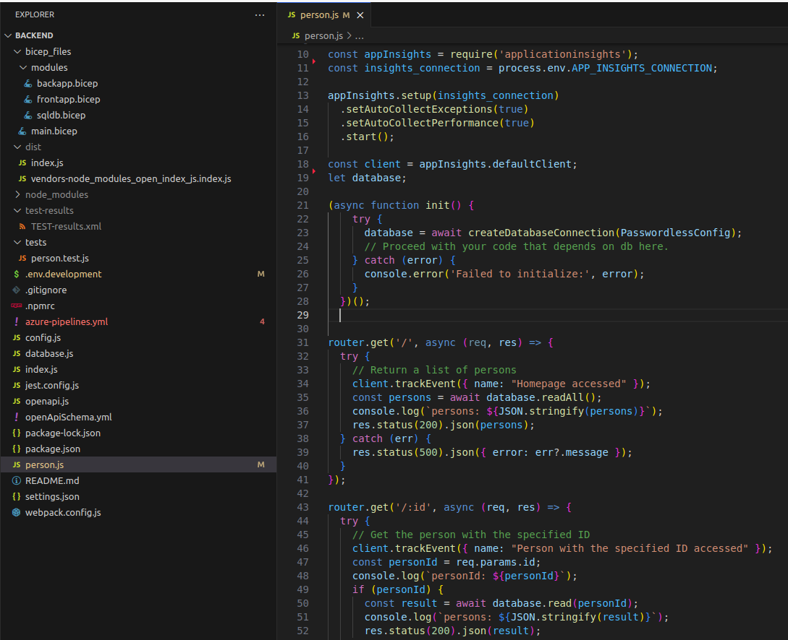

# Azure DevOps Services Practical Tasks

**Practical Task 1: Deploy a Docker Container to Azure Container Instances (ACI) via Azure Portal**

**Requirements:**

- Log in to your Azure DevOps account and navigate to your project.
- Create a new Git repository named MyEnhancedRepo.
- Clone the repository to your local machine using Git.
- Initialize the repository with a README file directly in Azure DevOps, specifying the purpose of the repository.
- Clone the repository to your local machine and verify that the README.md file exists and contains the correct information.

**Practical Task 2: Implement Branching and Merging**

**Requirements:**

- Create a new branch named feature-enhancement from the main branch in your local repository.
- Add a new file named FEATURES.md to the feature-enhancement branch, detailing potential features for the project.
- Commit the changes and push the feature-enhancement branch to the remote repository in Azure Repos.
- Create a pull request from feature-enhancement to main, including a description of the changes and why they are necessary.
- Review the pull request and merge it into the main branch after resolving any conflicts that may arise.

**Practical Task 3: Set Up Branch Policies and Code Review**

**Requirements**

- Configure branch policies for the main branch in Azure Repos to require at least one reviewer for pull requests and to enforce a minimum number of successful builds (you can simulate this by using a mock build status if needed).
- Create a new branch named bugfix-issue from the main branch and make changes to the FEATURES.md file to address a hypothetical bug (e.g., update a feature description).
- Commit the changes and push the bugfix-issue branch to the remote repository.
- Create a pull request from bugfix-issue to main, ensuring that the pull request meets the branch policies set earlier.
- Invite at least one team member or colleague to review the pull request and provide feedback.
- Address any comments or requested changes from the reviewer and update the pull request accordingly.
- Merge the pull request into the main branch once it has been approved.

**Practical Task 4: Create a Simple Build Pipeline in Azure DevOps**

**Requirements:**

1. Log in to Azure DevOps:
a. Access your Azure DevOps organization and navigate to your project.
2. Create a Git Repository:
a. In Azure Repos, create a new Git repository named MySampleApp.
b. Clone the repository to your local machine and add a simple application (e.g., a basic .NET Core or Node.js application).
3. Create a Build Pipeline:
a. Navigate to Azure Pipelines and create a new pipeline.
b. Select the Azure Repos Git repository as the source.c. Use the YAML pipeline editor to define the pipeline, including the following steps: dotnet restore (for .NET) or npm install (for Node.js) to restore dependencies.
dotnet build (for .NET) or npm run build (for Node.js) to build the application.
dotnet test (for .NET) or a testing command for Node.js to run unit tests.
4. Run the Pipeline:
a. Save and run the pipeline.
b. Verify that the build pipeline completes successfully and check the build logs for any errors.

**Practical Task 5: Set Up Continuous Deployment (CD) to Azure Web App**

**Requirements:**

1. Extend the Build Pipeline:
a. Open the existing build pipeline created in Task 4.
b. Add a new stage for deployment after the build stage.
2. Create an Azure Web App:
a. In the Azure portal, manually create an Azure Web App or use an ARM template to create it.
3. Configure Release Pipeline:
a. Create a release pipeline in Azure DevOps that triggers automatically after a successful build.
b. Add an Azure Web App deployment task to the release pipeline, specifying the Azure subscription and the Web App name.
4. Deploy the Application:
a. Save and run the release pipeline.
b. Verify that the application is successfully deployed and accessible via the web.

**Practical Task 6: Implement CI/CD with GitHub and Azure Pipelines**

**Requirements:**

1. Create a GitHub Repository:
a. Navigate to GitHub and create a new repository named MySampleApp.
2. Push Application Code:
a. Push the application code from Task 4 to the new GitHub repository.
3. Set Up Azure Pipeline:
a. In Azure DevOps, create a new pipeline that uses the GitHub repository as the source.b. Authenticate with GitHub and select the repository.
4. Define the Pipeline:
a. Use the YAML pipeline editor to define the pipeline with steps to:
i. Build the application.
ii. Run tests.
iii. Deploy to the Azure Web App (similar to Task 5).
5. Enable GitHub Integration:
a. Configure the pipeline to trigger automatically on every push to the main branch.
b. Verify that the pipeline triggers successfully and the application is deployed to Azure.

**Practical Task 7: Use Azure Artifacts to Manage Dependencies**

**Requirements:**

1. Create an Azure Artifacts Feed:
a. In Azure DevOps, navigate to Artifacts and create a new feed named MyDependenciesFeed.
2. Publish Dependencies:
a. Modify the build pipeline to include a task that publishes the application’s dependencies (e.g., npm packages or NuGet packages) to the Azure Artifacts feed.
b. Use commands like npm publish or dotnet nuget push in the pipeline.
3. Restore Dependencies:
a. Update the build pipeline to restore dependencies from the Azure Artifacts feed during the build process.
4. Verify Dependency Management:
a. Run the pipeline and verify that the dependencies are correctly published to and
restored from the feed.

**Practical Task 8: Deploy Infrastructure as Code (IaC) with Bicep**

**Requirements:**

1. Create a Bicep File:
a. Create a Bicep file named main.bicep that defines the infrastructure for your application, including an Azure Web App and a SQL Database.
2. Create a New Pipeline:
a. Set up a new pipeline in Azure DevOps that includes a stage for deploying the Bicep file.
3. Deploy Using Azure CLI:
a. Use the Azure CLI task in the pipeline to deploy the Bicep file.
b. The command should look like:az deployment group create --resource-group <YourResourceGroup> --template-file main.bicep
4. Run the Pipeline:
a. Save and run the pipeline to ensure that the infrastructure is provisioned correctly in Azure.
b. Verify that the resources are created in the Azure portal.

**Practical Task 9: Implement Infrastructure as Code (IaC) with Terraform**

**Requirements:**

1. Create a Terraform Configuration:
a. Create a Terraform configuration file (main.tf) that defines the same infrastructure as in Task 8 (e.g., Azure Web App and SQL Database).
2. Set Up a New Azure Pipeline:
a. Create a new Azure Pipeline that runs Terraform commands.
b. Use the following steps in the pipeline: 
   - terraform init to initialize the Terraform working directory. 
   - terraform plan to create an execution plan.
   - terraform apply -auto-approve to apply the changes.
3. Configure Triggers:
a. Set up the pipeline to trigger on changes to the Terraform files in the repository.
4. Run the Pipeline:
a. Save and run the pipeline to provision the infrastructure in Azure.
b. Verify that the resources are created as expected.

[azure-pipelines.yml](iac_terraform/azure-pipelines.yml)

[main.tf](iac_terraform/main.tf)

[variables.tf](iac_terraform/variables.tf)

**Practical Task 10: Integrate Azure Test Plans with CI/CD Pipelines**

**Requirements:**

1. Create a Test Plan:
a. Navigate to Azure Test Plans and create a new test plan that includes both manual and automated tests for your application.
2. Modify the Build Pipeline:
a. Update the build pipeline to include a testing stage that runs automated tests using a testing framework (e.g., NUnit for .NET or Jest for Node.js).
b. Add a task in the pipeline to publish the test results.
3. Configure Release Pipeline:
a. Modify the release pipeline to deploy the application only if all tests pass.
b. Use conditions in the release pipeline to check for successful test results.
4. Run the Pipeline:a. Trigger the pipeline and verify that it runs the tests and reports the results back to Azure Test Plans.
b. Ensure that any failed tests block the deployment process.

**Practical Task 11: Full CI/CD Pipeline with Infrastructure as Code, Testing, and Artifact**

**Requirements:**

1. Design the Application Architecture:
a. Create a simple application that consists of multiple components (e.g., a frontend application, a backend API, and a database).
2. Create a Bicep File for Infrastructure:
a. Create a Bicep file (main.bicep) that provisions all necessary resources for the application, including:
   - i. An Azure App Service for the frontend.
   - ii. An Azure Function or Azure App Service for the backend API.
   - iii. An Azure SQL Database or Cosmos DB for data storage.
b. Ensure that the Bicep file includes networking components, such as a Virtual Network and Subnets if needed.
3. Create Terraform Configuration:
   - a. Create a Terraform configuration (main.tf) that defines the same infrastructure as the Bicep file.
   - b. Ensure that the Terraform configuration can be used to provision the infrastructure independently.
4. Set Up Azure Artifacts:
   - a. Create an Azure Artifacts feed to store the application’s packages (e.g., npm packages for the frontend and NuGet packages for the backend).
   - b. Modify the build pipelines to publish the application’s packages to the Azure Artifacts feed.
5. Create CI/CD Pipelines:
   - a. Create two separate pipelines: one for the frontend and one for the backend.
6. Frontend Pipeline:
   - a. The pipeline should:
     - i. Trigger on changes to the frontend code in the repository.
     - ii. Build the frontend application and run unit tests.
     - iii. Publish the build artifacts to Azure Artifacts.
     - iv. Deploy the frontend application to the Azure App Service using the Bicep file
7. Backend Pipeline:
   - a. The pipeline should:
     - i. Trigger on changes to the backend code in the repository.
     - ii. Build the backend API and run unit tests.
     - iii. Publish the backend API package to Azure Artifacts.iv. Deploy the backend API to Azure using the Bicep file.
8. Integrate Azure Test Plans:
   - a. Create a comprehensive test plan in Azure Test Plans that includes both manual and automated tests for both the frontend and backend.
   - b. Update both pipelines to include a testing stage that runs automated tests and publishes the results to Azure Test Plans.
9. Implement Continuous Monitoring:
   - a. Set up Application Insights for both the frontend and backend applications to monitor performance and errors.
   - b. Configure alerts for critical issues that may arise in the production environment.
10. Run the Full CI/CD Process:
   - a. Trigger both pipelines by making changes to the codebase.
   - b. Verify that the entire CI/CD process runs smoothly, from code commit to deployment.
   - c. Check the Azure portal to ensure all resources are provisioned correctly and that the applications are running as expected.

[backapp.bicep](ci_cd/backapp.bicep)

[frontapp.bicep](ci_cd/frontapp.bicep)

[sqldb.bicep](ci_cd/sqldb.bicep)

[main.bicep](ci_cd/main.bicep)

[main.tf](ci_cd/main.tf)

[variables.tf](ci_cd/variables.tf)

[azure-pipelines.yml](ci_cd/azure-pipelines.yml)

