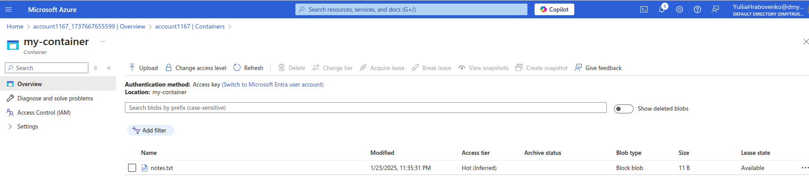
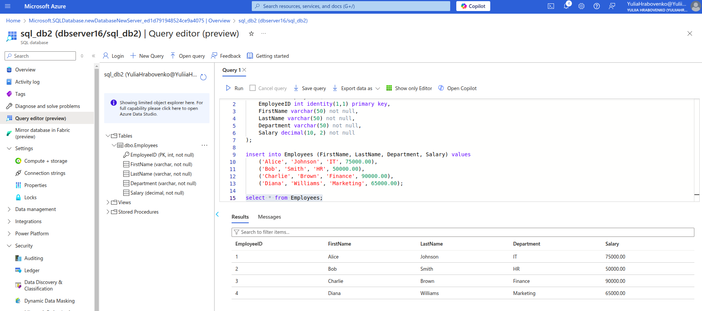
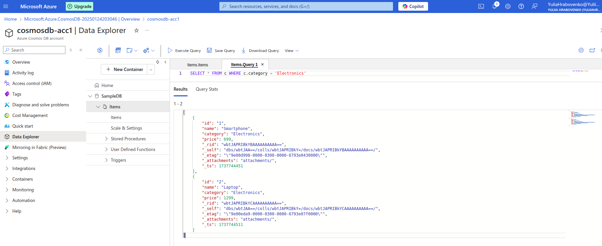

# Azure Storage and Databases Practical tasks

**Practical Task 1: Upload and Retrieve Files with Azure Blob Storage**

*Use Azure Blob Storage for storing and retrieving files*

Create a new storage account in Azure

Set up a Blob container named "my-container" with public access

Upload a sample text file to the Blob container using the Azure portal

Use Azure Storage Explorer to manage and view blobs in your container

Download the uploaded file to verify successful retrieval

**Practical Task 2: Lifecycle Management for Blob Storage**

*Implement lifecycle management policies to optimize storage costs*

Create a storage account and a Blob container named "lifecycle-container"

Upload multiple files of varying sizes to the container

Create a lifecycle management policy to move blobs to the Cool tier after 30 days and delete blobs older than 90 days

Simulate policy execution by manually testing with different file creation timestamps and verify that blobs are moved or deleted according to the policy

Enabled soft delete policy

List available blobs

List deleted blobs

**Practical Task 3: Implementing an Azure Queue for Message Storage**

*Create and manage an Azure Queue to store and process messages*

Create a storage account and enable the Queue service

Create a queue named "task-queue"

Use Azure Storage Explorer or the Azure portal to add messages to the queue

Retrieve and process messages directly using Azure Storage Explorer or the Azure portal interface

Verify that processed messages are removed from the queue manually

**Practical Task 4: Configuring Azure File Share and Mounting on a Local Machine**

*Set up and access Azure File Storage for shared file access*

Create a storage account and set up an Azure File Share

Upload a file to the file share using the Azure portal

Generate a connection script for Windows or Linux and use it to mount the file share on your local machine

Verify the mounted file share and ensure it displays the uploaded file

Add another file to the file share from the local machine and confirm it reflects in Azure

**Practical Task 5: Storing and Querying Data with Azure Table Storage**

*Set up and use Azure Table Storage for structured data*

Create a storage account and enable the Table service

Create a table named "employee-data"

Add sample data (e.g., employee IDs, names, and roles) to the table using Azure Storage Explorer or Azure CLI

Query the table for specific data using filters (e.g., "Role = Developer")

Delete specific entries from the table and verify the changes

**Practical Task 6: Configuring Shared Access Signatures (SAS) for Secure Access**

*Secure Azure Storage services using SAS tokens*

Create a storage account with Blob, File, Queue, and Table services enabled

Create a container

Generate a Shared Access Signature (SAS) token for Blob storage with limited permissions (e.g., read-only access)

Share the SAS token URL and verify access to the Blob container with the token

View blob properties

Failure to upload a file to the storage

Repeat the process for File, Queue, and Table services with different permissions

File

Queue storage

Table storage

**Practical Task 7: Implementing Security Best Practices with Azure RBAC and Managed Identities**

*Securely manage access to Azure resources and integrate services using Managed Identities*

1.Configure Azure RBAC for a Storage Account:

Create a storage account named "secure-storage"

Add a user or service principal with Storage Blob Data Contributor role

Verify that the user or service principal can upload and download blobs to the account

Attempt access with an unauthorized user and verify access is denied

2.Set Up a Managed Identity for an Azure Virtual Machine:

Create an Azure Virtual Machine (VM) with a system-assigned Managed Identity enabled

Assign the Storage Blob Data Reader role to the Managed Identity for "securestorage"

Connect to the VM and verify that the Managed Identity can access blob data using Azure CLI or a pre-installed script

**Practical Task 8: Creating and Querying an Azure SQL Database**

*Learn to create and query an Azure SQL Database using the Azure portal*

Create an Azure SQL Database named "test-db" in a new logical SQL server. Set the pricing tier to the free tier for cost optimization

Use the Query Editor in the Azure portal to create a table named "Products" with columns for ID, Name, and Price
Insert a few sample records into the "Products" table using a SQL query
Query the table to display all records and verify the data

**Practical Task 9: Deploying an Azure SQL Database with Automated Backup Configuration**

*Set up an Azure SQL Database and configure automated backups*

Create an Azure SQL Database in a new or existing resource group

Choose the desired service tier (e.g., Basic or General Purpose)

Enable and configure long-term backup retention for the database

Use the Azure portal to verify backup settings and review available restore points

Test the restore process by creating a new database from a backup

**Practical Task 10: Getting Started with Cosmos DB**

*Set up and explore Cosmos DB by creating a database, managing data, querying, and testing key features like consistency and global distribution*

1.Create a Cosmos DB Account:

Create a new Cosmos DB account in the Azure portal using the Core (SQL) API

Select a region for the account and use the default settings

Review key features like throughput, consistency levels, and global distribution

Note down the primary and secondary keys for the account

2.Set Up a Database and Container:

Create a database named "SampleDB" in the Cosmos DB account

Add a container named "Items" with the partition key set to /category

Use the default throughput settings for the database and container

Insert Data Using Data Explorer:

Open the Data Explorer in the Azure portal

Insert at least three sample JSON documents into the "Items" container

Verify that the documents are successfully added and visible in the Data Explorer

Query Data in Cosmos DB:

Use SQL-like queries in the Data Explorer to retrieve data:

Retrieve all documents: SELECT * FROM c

Retrieve specific documents: SELECT * FROM c WHERE c.category = 'Electronics

Configure and Test Consistency Levels:

Review the available consistency levels in the Cosmos DB account: Eventual, Session, Consistent Prefix, Bounded Staleness, Strong

Set the account-level consistency to "Session."

Perform a query or data operation and observe the impact on performance and latency

Enable Global Distribution and Test Replication:

Enable multi-region replication by adding at least one additional region to the Cosmos DB account

Insert new data into the primary region and verify that it replicates to the secondary region

Read from the secondary region using Java SDK

Perform a manual failover and verify that the secondary region becomes the primary

