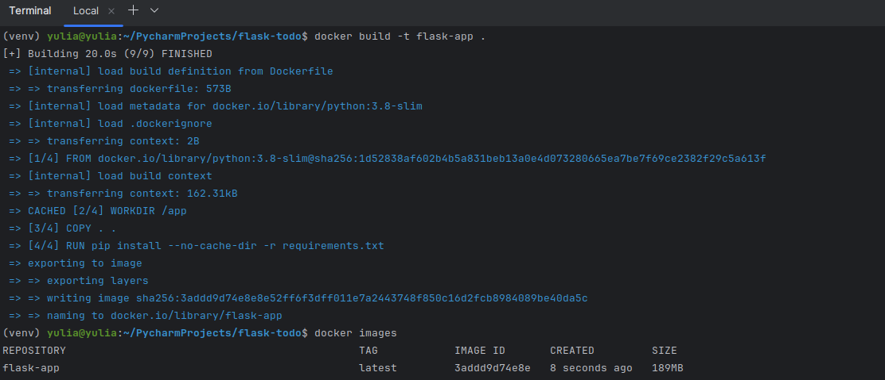
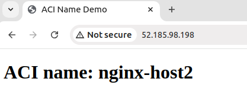
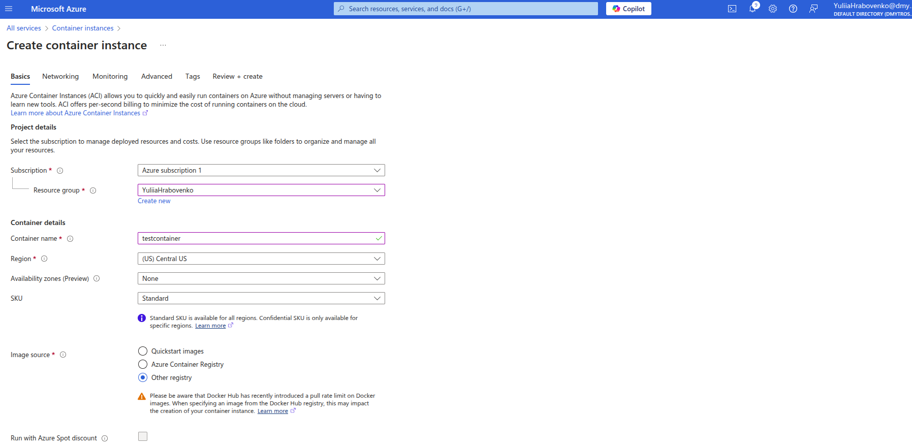
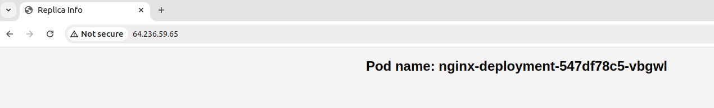
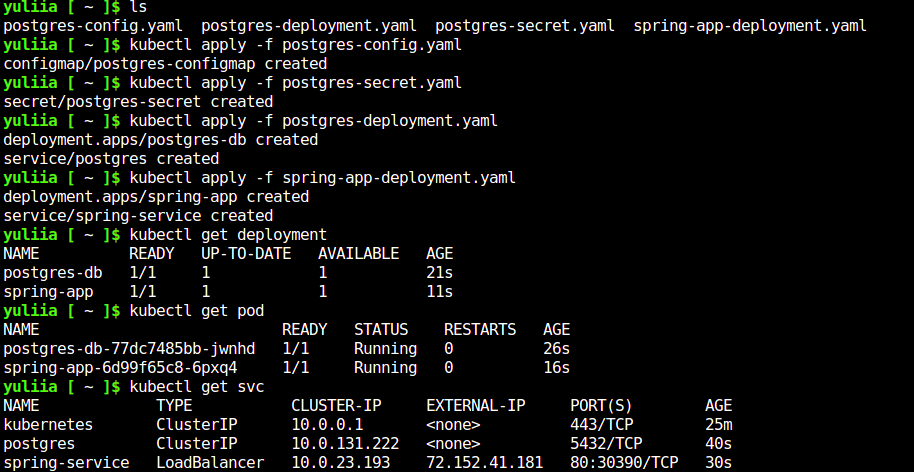
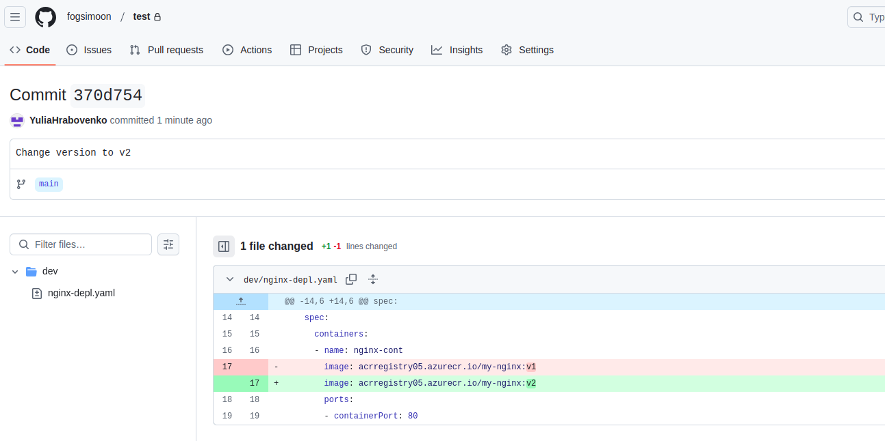

# Containerization and Orchestration_Practical Tasks

**Practical Task 1: Deploy a Docker Container to Azure Container Instances (ACI) via Azure Portal**

**Requirements:**

1. Create a lightweight Docker image for a simple web application (e.g., a Python Flask app)
with minimal dependencies to reduce resource usage.
2. Push the Docker image to Azure Container Registry (ACR) using a low-cost storage option.
3. Use a lightweight ACI instance (e.g., B1s) to deploy the Docker container from ACR.
4. Verify the deployment by accessing the web application via the public IP address provided
by ACI.
5. Remove the ACI container after verifying the deployment to stop billing.

App used for deployment: https://github.com/patrickloeber/flask-todo

**Practical Task 2: Configure Environment Variables in ACI via Azure Portal**

**Requirements:**

1. Modify your Docker image to read configuration values from environment variables,
ensuring minimal environmental complexity.
2. Reuse the ACI instance from Task 1 to deploy the container and specify the necessary
environment variables.
3. Verify that the application is correctly using the environment variables by checking its
output.
4. Remove the ACI container after verifying that the application correctly uses the
environment variables.

**Practical Task 3: Scale Out with Azure Container Instances via Azure Portal**

**Requirements:**

1. Deploy a stateless Docker container to Azure Container Instances using a lightweight
configuration (e.g., B1s instances).
2. Manually scale out to the minimum number of instances required (e.g., 2–3) to test load
distribution.
3. Stop all ACI instances after completing the testing to reduce ongoing costs.

**Practical Task 4: Secure a Docker Container in ACI with Managed Identity via Azure Portal**

**Requirements:**

1. Deploy a Docker container to Azure Container Instances using the existing lightweight ACI
setup from previous tasks.
2. Configure a Managed Identity for the ACI and securely access an Azure service (e.g., Azure
Key Vault) with minimal permissions and access scope.
3. Retrieve only a single secret from Azure Key Vault for testing purposes.
4. Remove the ACI container after verifying secure access.

**Practical Task 5: Deploy a Kubernetes Cluster with AKS via Azure Portal**

**Requirements:**

1. Create an Azure Kubernetes Service (AKS) cluster with the smallest VM size (e.g., B2s) and
the minimum number of nodes (e.g., 1–2).
2. Connect to the AKS cluster using Azure Cloud Shell with kubectl.
3. Deploy a lightweight Nginx application for verification.
4. Delete the AKS cluster immediately after testing to avoid additional VM and cluster costs.

**Practical Task 6: Deploy a Containerized Application on AKS**

**Requirements:**

1. Build a lightweight Docker image for a simple web application (e.g., a Node.js app with
minimal dependencies) and push it to Azure Container Registry (ACR).
2. Reuse the AKS cluster from Task 5 to deploy the application using a Kubernetes deployment
and service manifest file.
3. Test the application for a limited time and remove the deployment afterward.

**Practical Task 7: Configure and Use ConfigMaps and Secrets in AKS**

**Requirements**

1. Create a ConfigMap to store non-sensitive configuration data with only the required keyvalue pairs for the application.
2. Create a Kubernetes Secret to store sensitive data (e.g., API keys) with the least amount of
information needed.
3. Update the application deployment to use the ConfigMap and Secret.
4. Remove the ConfigMap, Secret, and deployment after testing.

App used for deployment: https://github.com/davidarchanjo/spring-boot-crud-rest

**Practical Task 8: Scale Applications in AKS**

**Requirements:**

1. Deploy a stateless application to the AKS cluster using minimal resource specifications.
2. Use the kubectl scale command to manually scale the application to only 2–3 replicas for
testing.
3. Set up Horizontal Pod Autoscaler (HPA) with reasonable CPU usage thresholds to minimize
pod creation.
4. Simulate load on the application for a short duration and remove the deployment after
observing the scaling behavior.

**Practical Task 9: Rolling Update of an Application in AKS**

**Requirements:**

1. Deploy a lightweight version of your application to the AKS cluster.
2. Update the Docker image to a new version with minimal changes (e.g., color change).
3. Perform a rolling update using kubectl set image with minimal replicas to reduce resource
usage.
4. Verify the update process quickly and remove the deployment after the update.

**Bonus task. GitOps with AKS**

**Requirements:**

1. Setup ArgoCD on Azure Kubernetes Services
2. Perform image update on cluster

