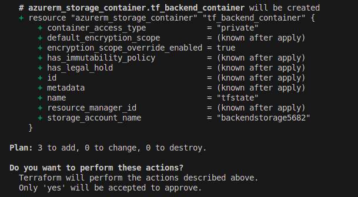
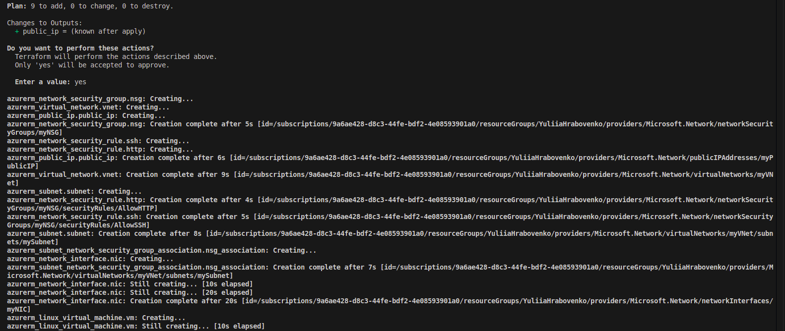
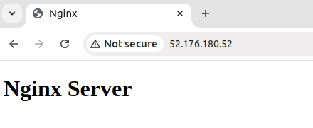
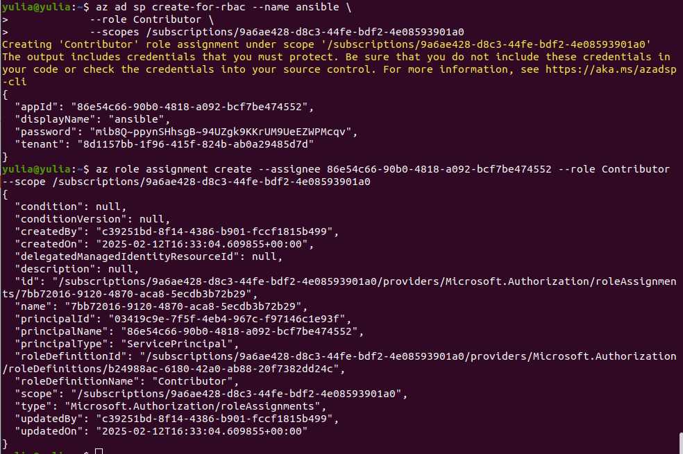
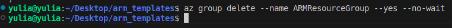

# Infrastructure as Code (IaC) Monitoring And Logging Practical Tasks

**Practical Task 1: Install, Configure, and Manage Terraform State in Azure**

**Practical Task 2: Deploy an Azure Virtual Machine with a Custom Network and Security Rules**

**Practical Task 3: Implement a Scalable Infrastructure with Load Balancer and Auto Scaling**

**Practical Task 4: Install and Configure Ansible for Azure**

[list_resource_groups.yml](task4/list_resource_groups.yml)

**Practical Task 5: Deploy an Azure Virtual Machine with Ansible**

**Practical Task 7: Deploy a Resource Group Using an ARM Template**

**Practical Task 8: Deploy an Azure Storage Account Using an ARM Template**

**Practical Task 9: Terraform: Deploy a Production-Ready AKS Cluster with GitOps & Secret Management & Monitoring**

**Practical Task 10: Deploy a Virtual Machine with Networking Using an ARM Template**

**Convert an ARM Template to Bicep**

[storage-account.bicep](task11/storage-account.bicep)

[refactored-storage-account.bicep](task11/refactored-storage-account.bicep)

